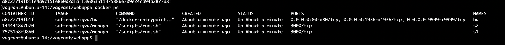
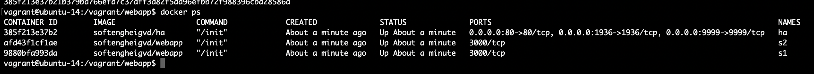
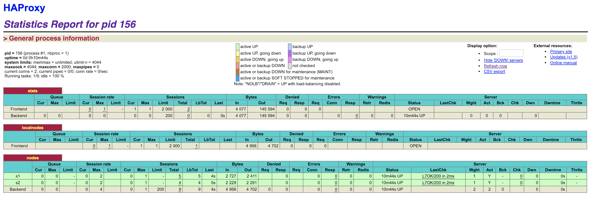
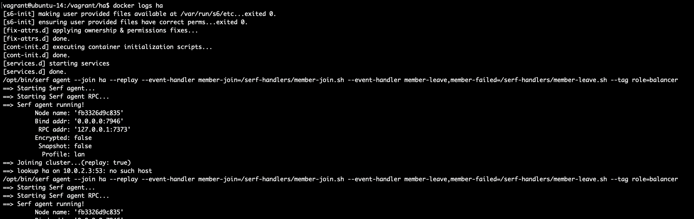
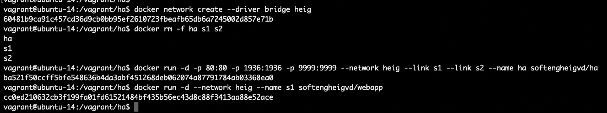

# Administration IT
## Laboratoire n°4 :

> Auteurs : Loic Frueh - Koubaa Walid	
> Date : 07.01.2019  

###Pedagogical objectives
Build your own Docker images

Become familiar with lightweight process supervision for Docker

Understand core concepts for dynamic scaling of an application in production

Put into practice decentralized management of web server instances

Instructions for the lab report
This lab builds on a previous lab on load balancing.

In this lab you will perform a number of tasks and document your progress in a lab report. Each task specifies one or more deliverables to be produced. Collect all the deliverables in your lab report. Give the lab report a structure that mimics the structure of this document.

We expect you to have in your repository (you will get the instructions later for that) a folder called report and a folder called logs. Ideally, your report should be in Markdown format directly in the repository.

###Task 0: Identify issues and install the tools

First we install all the tools we need as we did on the previous laboratory.

**Deliverables**

Here is the screenshot of our backend nodes on HAProxy:

Here is the url of our repository:

https://github.com/zedsdead95/Teaching-HEIGVD-AIT-2016-Labo-Docker

Here is our answers for the questions

**M1: Do you think we can use the current solution for a production environment? What are the main problems when deploying it in a production environment?**

**[M2] Describe what you need to do to add new webapp container to the infrastructure. Give the exact steps of what you have to do without modifiying the way the things are done. Hint: You probably have to modify some configuration and script files in a Docker image.**

**[M3] Based on your previous answers, you have detected some issues in the current solution. Now propose a better approach at a high level.**

**[M4] You probably noticed that the list of web application nodes is hardcoded in the load balancer configuration. How can we manage the web app nodes in a more dynamic fashion?**

**[M5] In the physical or virtual machines of a typical infrastructure we tend to have not only one main process (like the web server or the load balancer) running, but a few additional processes on the side to perform management tasks.**

###Task 1

We followed all the instructions, build the new images and killed the previous containers and rebuild them after modifyig the Dockerfiles.

We executed the scripts furnished.

Here are the containers created 

Then we need to configure S6 as our main process.
Once again we followed all the instructions, build the new images and killed the previous containers and rebuild them after modifyig the Dockerfiles.

We execute 	

		mkdir -p /vagrant/ha/services/ha /vagrant/webapp/services/node

We have then the appropriate structure.

Once copied, we replaced the hashbang instruction in both files.

The start scripts are ready but now we must copy them to the right place in the Docker image. In both ha and webapp Docker files, you need to add a COPY instruction to setup the service correctly.

We did that, and rebuild images and restarted the containers.

1. Here is the screenshot of the stats page of HAProxy at http://192.168.42.42:1936.

	

2. We did not found difficulties doing these tasks since scripts were furnished.

	We need to install a process supervisor to be able to run more than one service per container. That is because we have discovered that we can install a serf agent as a service in each container next to it's main service in order to modify the load balancer's configuration when we add or remove backend nodes.
	
	
	
###Task 2

After installing serf dependances we execute

mkdir /vagrant/ha/services/serf /vagrant/webapp/services/serf

Then we copied the run file from ha/services/serf to webapp folder.

We succeeded in applying modifications on Dockerfiles and we tested the logs for the containers. Here is a part of the log for **ha container**

Then we created the bridge and killed all containers.

1. the logs are in the logs folder

2. The answer is up, in task 0.

3. //TODO by loic

##Task 3
We copied the scripts as asked.

We modified the dockerfile.

We then build and run our docker images/containers.

1. The logs are in the logs folder.

2. For the in-container logs, we copies both logs from vagrant for ha container and the bash log in the same file :)

##Task 4

First we install nodejs.

Then we modify the scripts as specified.

1. TODO loic

2.

3. We got the log save on logs folder

	The file for docker logs is named docker_log

4. TODO Loic

