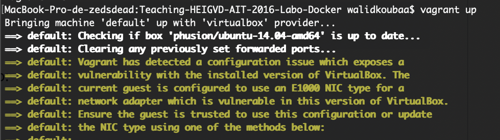
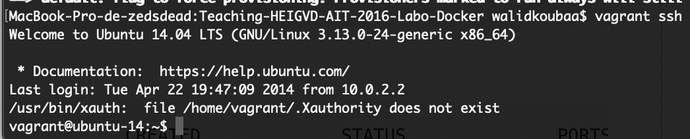
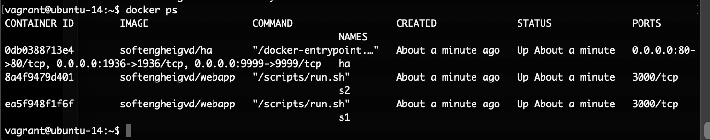
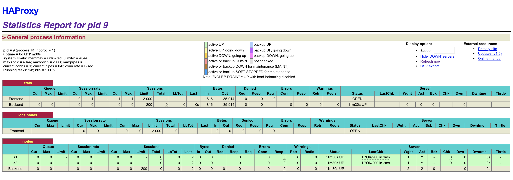

# Administration IT
## Laboratoire n°4 :

> Auteurs : Loic Frueh - Koubaa Walid	
> Date : 07.01.2019  


###Pedagogical objectives
Build your own Docker images

Become familiar with lightweight process supervision for Docker

Understand core concepts for dynamic scaling of an application in production

Put into practice decentralized management of web server instances

Instructions for the lab report
This lab builds on a previous lab on load balancing.

In this lab you will perform a number of tasks and document your progress in a lab report. Each task specifies one or more deliverables to be produced. Collect all the deliverables in your lab report. Give the lab report a structure that mimics the structure of this document.

We expect you to have in your repository (you will get the instructions later for that) a folder called report and a folder called logs. Ideally, your report should be in Markdown format directly in the repository.

###Task 0: Identify issues and install the tools

First we install all the tools we need as we did on the previous laboratory.








**Deliverables**

Here is the screenshot of our backend nodes on HAProxy:




Here is the url of our repository:

https://github.com/zedsdead95/Teaching-HEIGVD-AIT-2016-Labo-Docker


Here is our answers for the questions

**M1: Do you think we can use the current solution for a production environment? What are the main problems when deploying it in a production environment?**

No we can't use this solution for a production environement. The main problems are that every time a node is added or removed for some reason, we have to edit the config files manually which is not good for a production environment. Moreover, we need to rebuild the images after every modification which cause a lack of disponibility.

**[M2] Describe what you need to do to add new webapp container to the infrastructure. Give the exact steps of what you have to do without modifiying the way the things are done. Hint: You probably have to modify some configuration and script files in a Docker image.**

First we need to modify the **haproxy.cfg** and add a new node in the load balancer:

In the "Define the list of nodes" part add ```server s3 <s3>:3000 check```

Then add the new container to the **run.sh** script:

```sed -i 's/<s3>/$S3_PORT_3000_TCP_ADDR/g' /usr/local/etc/haproxy/haproxy.cfg```

Next modify the **provision.sh** and add these lines:
```docker rm -f s3 2>/dev/null || true docker ```

```run -d --name s3 softengheigvd/webapp```


**[M3] Based on your previous answers, you have detected some issues in the current solution. Now propose a better approach at a high level.**

A better aproach would be to have a daemon software always running in background that detects every change in the infrastructure (node's addition or deletion) and edit the config files as in the M2 point.

**[M4] You probably noticed that the list of web application nodes is hardcoded in the load balancer configuration. How can we manage the web app nodes in a more dynamic fashion?**

We need to use a tool that runs on all nodes and exchange message periodically in order to know which node is currently running and then update the config files dynamically. This tool, for this lab, is named **SERF**. This tool allows us to update the load balancer configuration dynamically.

**[M5] In the physical or virtual machines of a typical infrastructure we tend to have not only one main process (like the web server or the load balancer) running, but a few additional processes on the side to perform management tasks. For example to monitor the distributed system as a whole it is common to collect in one centralized place all the logs produced by the different machines. Therefore we need a process running on each machine that will forward the logs to the central place. (We could also imagine a central tool that reaches out to each machine to gather the logs. That's a push vs. pull problem.) It is quite common to see a push mechanism used for this kind of task. Do you think our current solution is able to run additional management processes beside the main web server / load balancer process in a container? If no, what is missing / required to reach the goal? If yes, how to proceed to run for example a log forwarding process?**

Current solution only run one process per container. For this case we need to run multiple process in the same docker container.
In order to do this, we need to add a new abstract layer such as a process supervisor in each container. This process supervisor will be always running in background and monitoring other processes.

**[M6] In our current solution, although the load balancer configuration is changing dynamically, it doesn't follow dynamically the configuration of our distributed system when web servers are added or removed. If we take a closer look at the run.sh script, we see two calls to sed which will replace two lines in the haproxy.cfg configuration file just before we start haproxy. You clearly see that the configuration file has two lines and the script will replace these two lines. What happens if we add more web server nodes? Do you think it is really dynamic? It's far away from being a dynamic configuration. Can you propose a solution to solve this?**

If we add some nodes we also have to add them in the load balancer config file. Currently this has to be done manually which is bad. A solution, in this lab, would be the usage of a template engine. The template will use the datas provided by the **SERF agents** to generate the config file.


